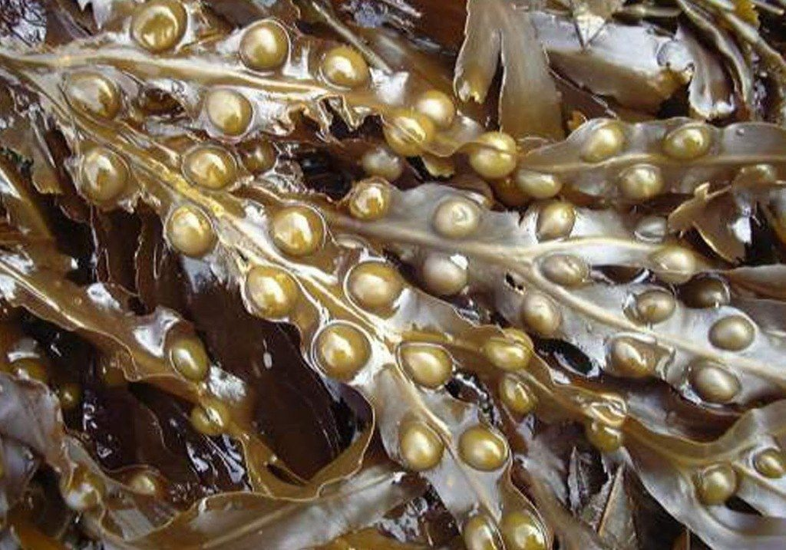
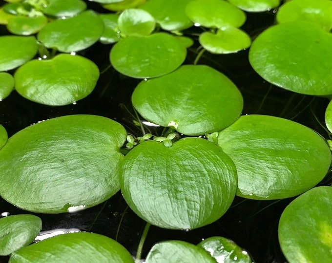
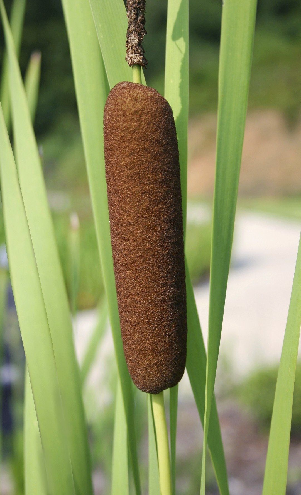
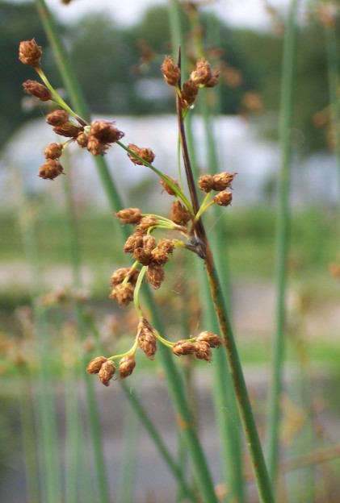
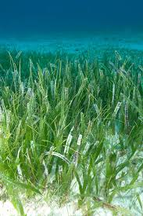
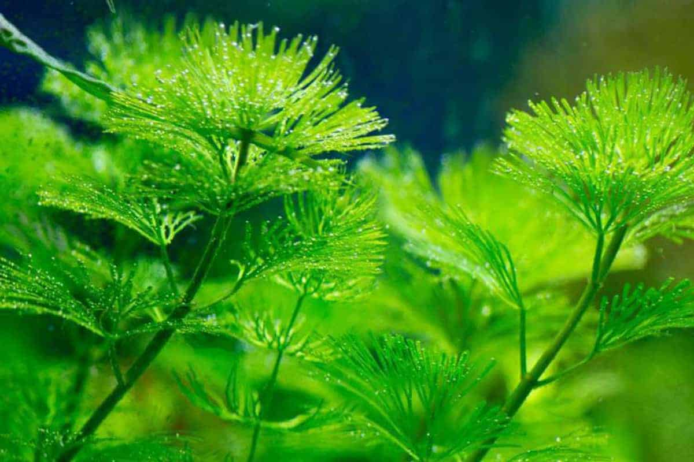
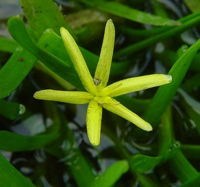
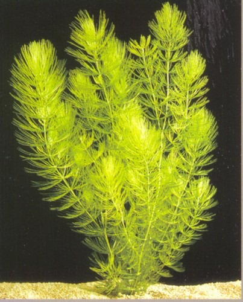
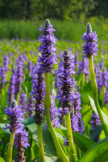
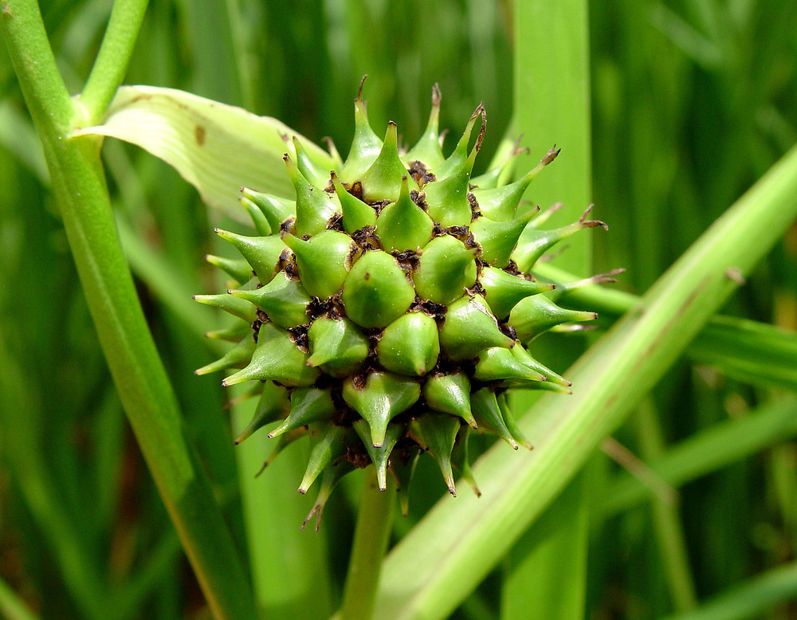

# Lisondra-MarjorieMae_LW2_Image_Plant_Classification

## A. PROJECT OVERVIEW

<blockquote>

  

    The project, Plant Species Image Classification Using Teachable Machine, involves building an image classification model that can identify plant species from images. For this activity, I selected aquatic plants as the focus, since they are a distinct group of plants that live in water-based environments such as freshwater bodies, wetlands, and coastal areas.
  

  

    The purpose of the image classification model is to train the system to differentiate between various aquatic plant species by analyzing visual features such as shape, color, and growth patterns. This activity allowed me to better understand the basics of image classification and machine learning while applying the technology to a real-world topic related to plants and the environment.
  

</blockquote>

## B. PLANT SPECIES SECTION

### 1. Rockweed *(Ascophyllum nodosum)*

<blockquote>

  A brown marine alga found along rocky coastlines in intertidal zones. It has long, strap-like fronds with air bladders that help it float. Rockweed provides shelter and food for many marine invertebrates and plays a role in coastal nutrient cycling.

</blockquote>

### 2. Frogbit *(Hydrocharis morsus-ranae)*

<blockquote>

  A free-floating freshwater plant with round, glossy leaves resembling small lily pads. It reproduces rapidly through stolons and forms dense mats on still or slow-moving waters, providing cover for aquatic organisms but sometimes becoming invasive.

</blockquote>

### 3. Cattail *(Typha latifolia)*

<blockquote>

  An emergent wetland plant with tall, narrow leaves and a distinctive brown cylindrical flower spike. Common in marshes and pond margins, cattails stabilize soil, filter pollutants, and provide habitat for birds and insects.

</blockquote>

### 4. Reed *(Phragmites australis)*

<blockquote>

  A tall perennial grass growing in wetlands and along shorelines. It forms dense stands with hollow stems and feathery flower plumes. Reeds are effective at erosion control but can outcompete native vegetation when invasive.

</blockquote>

### 5. Scirpus Bulrush *(Schoenoplectus lacustris)*

<blockquote>

  An emergent wetland plant with tall, narrow leaves and a distinctive brown cylindrical flower spike. Common in marshes and pond margins, cattails stabilize soil, filter pollutants, and provide habitat for birds and insects.

</blockquote>

### 6. Sea Grape *(Coccoloba uvifera)*

<blockquote>

  A coastal shrub or small tree with large, leathery, round leaves and grape-like fruit clusters. Found along tropical shorelines, it helps prevent erosion and tolerates salt spray and sandy soils.

</blockquote>

### 7. Turtle Grass *(Thalassia testudinum)*

<blockquote>

  A marine seagrass with flat, ribbon-like leaves forming underwater meadows. It grows in shallow coastal waters and is a critical food source for sea turtles, while also stabilizing sediments and improving water clarity.

</blockquote>

### 8. Cabomba *(Cabomba caroliniana)*

<blockquote>

  A fully submerged freshwater plant with finely divided, fan-shaped leaves. It thrives in slow moving or still waters and provides habitat for fish, though it may become invasive in non native regions.

</blockquote>

### 9. Large-leaf Pondweed *(Potamogeton amplifolius)*

<blockquote>

  A rooted aquatic plant with both submerged and floating broad leaves. Common in lakes and ponds, it is an important food source for waterfowl and contributes to oxygenation of the water.

</blockquote>

### 10. Water Clover *(Marsilea quadrifolia)*

<blockquote>

  A small aquatic fern with four-lobed leaves resembling a clover. It grows in shallow water or muddy substrates and reproduces via spores, often spreading across wetlands and rice fields.

</blockquote>

### 11. Marsh Marigold *(Caltha palustris)*

<blockquote>

  A perennial wetland plant with bright yellow flowers and rounded leaves. Found in marshes and stream edges, it blooms early in spring and supports pollinators.

</blockquote>

### 12. Water Stargrass *(Heteranthera dubia)* 

<blockquote>

  A submerged freshwater plant with narrow leaves and small yellow flowers that rise above the water surface. It grows in clear, slow-moving waters and provides shelter for fish and invertebrates.

</blockquote>

### 13. Hornwort *(Ceratophyllum demersum)*

<blockquote>

  A rootless submerged plant with whorled, forked leaves. It floats freely or anchors loosely in sediment and is known for oxygenating water and inhibiting algae growth.

</blockquote>

### 14. Pickerelweed *(Pontederia cordata)*

<blockquote>

  An emergent aquatic plant with heart-shaped leaves and spikes of violet-blue flowers. Common in shallow freshwater habitats, it is valuable for erosion control and as a food source for wildlife.

</blockquote>

### 15. Water Mimosa *(Neptunia oleracea)*

<blockquote>

  A floating or creeping aquatic plant with sensitive, feathery leaves that fold when touched. It grows in tropical wetlands and is capable of nitrogen fixation, improving soil fertility.

</blockquote>

### 16. Blue Flag Iris *(Iris versicolor)*

<blockquote>

  A perennial wetland plant with sword-like leaves and large blue-purple flowers. It grows along pond margins and marshes, contributing to wetland biodiversity and aesthetics.

</blockquote>

### 17. Giant Bur-reed *(Sparganium eurycarpum)*

<blockquote>

  An emergent aquatic plant with long, grass-like leaves and spherical, spiny seed heads. It thrives in shallow water and provides food and shelter for aquatic wildlife.

</blockquote>

### 18. Red Mangrove *(Rhizophora mangle)*

<blockquote>

  A coastal mangrove tree with distinctive prop roots that anchor it in soft sediments. It grows in tidal zones, protects coastlines from erosion, and serves as a nursery habitat for marine species.

</blockquote>

### 19. Golden Club *(Orontium aquaticum)*

<blockquote>

  A perennial aquatic plant with glossy lance-shaped leaves and a yellow, club-like flower spike. It grows in shallow freshwater and is among the earliest flowering aquatic plants.

</blockquote>

### 20. Arrow Arum *(Peltandra virginica)*

<blockquote>

  A wetland plant with large arrow-shaped leaves and a hooded green flower (spathe). It grows in marshes and slow-moving waters, providing cover for amphibians and aquatic organisms.

</blockquote>
